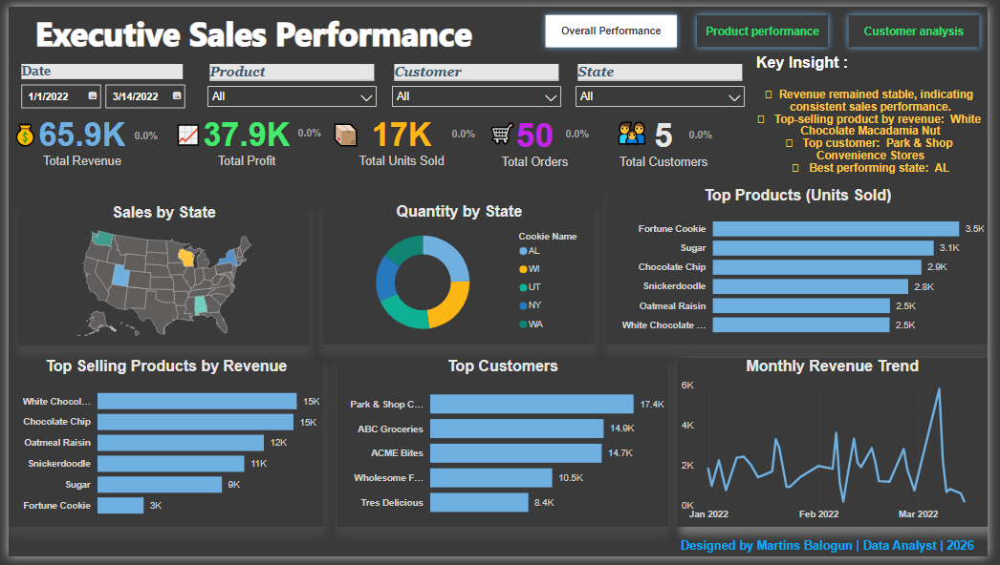
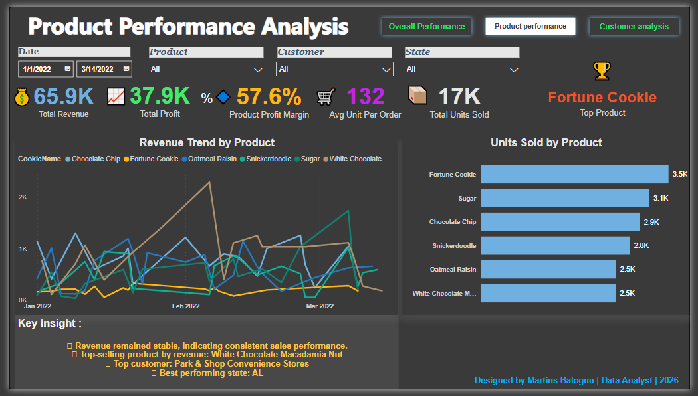
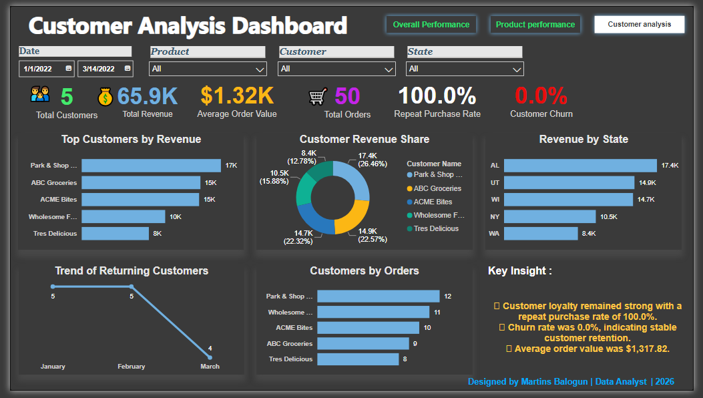

# Executive Sales Performance Dashboard

## Project Overview

This project is an interactive Power BI dashboard built to analyze sales, product performance, and customer behavior for a retail business.

The dashboard enables decision-makers to monitor revenue, profit, customer retention, product performance, and regional sales trends through interactive visualizations.

---

## Dashboard Preview

### Executive Sales Performance



---

### Product Performance



---

### Customer Analysis


---

## Business Problem

Businesses often struggle to answer questions such as:

- Which products generate the highest revenue?
- Which customers contribute the most sales?
- Which states perform best?
- Are sales increasing or decreasing?
- How loyal are customers?
- What is the average order value?

This dashboard provides answers to these questions using Power BI.

---

## Dashboard Pages

### 1. Executive Sales Performance
- Revenue KPI
- Profit KPI
- Units Sold
- Sales by State
- Monthly Revenue Trend
- Top Customers
- Top Selling Products
- Dynamic Business Insight

### 2. Product Performance
- Product Revenue
- Product Profit
- Units Sold
- Product Ranking
- Product Contribution
- Monthly Product Trend

### 3. Customer Analysis
- Customer Revenue
- Revenue Share
- Top Customers
- Customer Orders
- Returning Customers
- Customer Churn
- Repeat Purchase Rate

---

## Tools Used

- Microsoft Power BI
- Power Query
- DAX
- Microsoft Excel

---

## Key DAX Measures

- Total Revenue
- Total Profit
- Total Orders
- Total Customers
- Total Units Sold
- Average Order Value
- Customer Churn
- Repeat Purchase Rate
- Revenue Change %
- Dynamic Insight

---

## Dashboard Features

- Interactive slicers
- Drill-through navigation
- Navigation buttons
- KPI Cards
- Dynamic Insights
- Responsive visuals

---

## Project Highlights

✔ Built a three-page interactive Power BI dashboard.

✔ Created dynamic DAX measures for KPIs and business insights.

✔ Designed responsive navigation buttons for seamless report navigation.

✔ Implemented drill-through functionality for detailed analysis.

✔ Added dynamic business insight cards using DAX.

✔ Built customer retention and churn analysis.

✔ Used Power Query for data cleaning and transformation.

✔ Published the dashboard to Power BI Service.

---

## Files

Dashboard/
- Executive Sales Dashboard.pbix

Dataset/
- KCC Customer and Orders.csv

Documentation/
- Business Case.md
- DAX Measures.md

Images/
- Dashboard screenshots

---

## Skills Demonstrated

- Power BI
- DAX
- Power Query
- Data Modeling
- Data Visualization
- Dashboard Design
- Business Intelligence
- Data Cleaning
- Data Analysis

---

## Repository Structure

```text
Executive Sales Performance Dashboard
│
├── Dashboard
│   └── Executive Sales Dashboard.pbix
│
├── Dataset
│   └── KCC Customer and Orders.csv
│
├── Documentation
│   ├── Business Case.md
│   └── DAX Measures.md
│
├── Images
│   ├── overview-dashboard.png
│   ├── product-performance.png
│   └── customer-analysis.png
│
└── README.md
```

---

## Author

**Martins F. Balogun**

Data Analyst

GitHub: *https://github.com/bmartech/bmartech.github.io*

LinkedIn: *https://www.linkedin.com/in/mfbalogun*

---

## License

This project is available for educational and portfolio purposes.